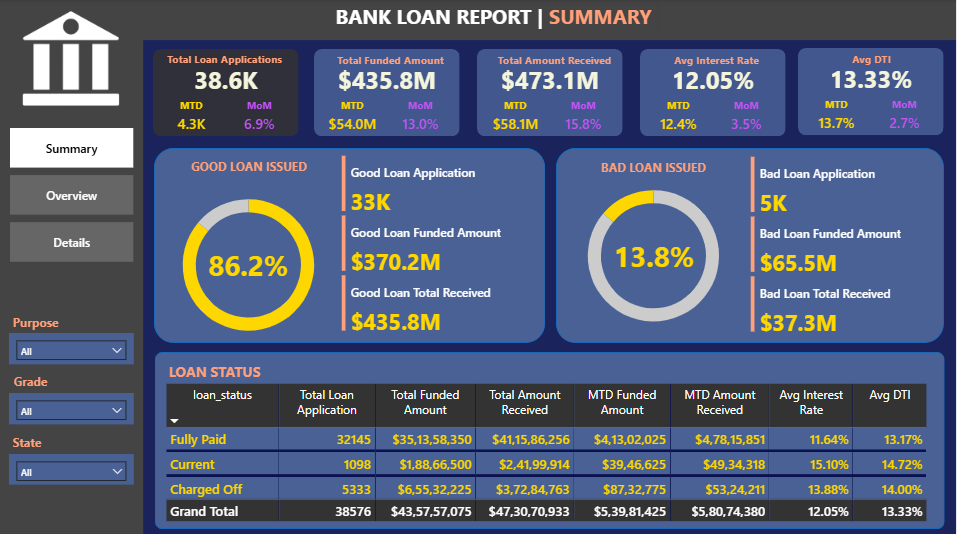
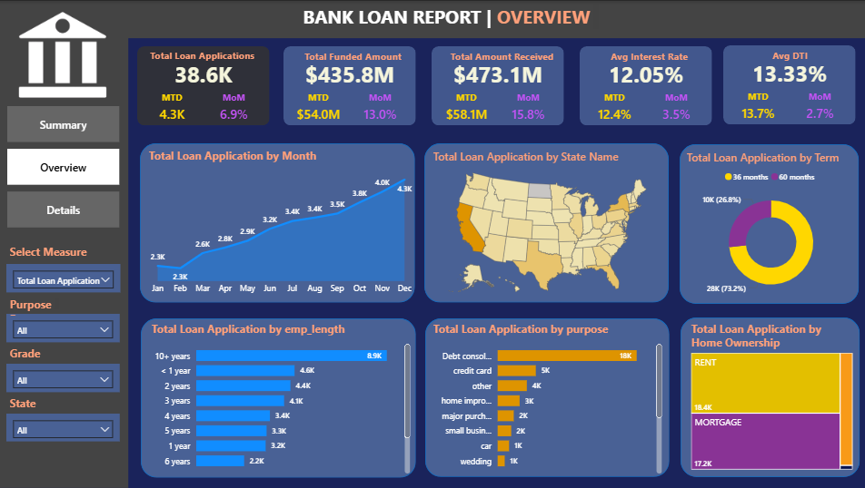

# Bank-Loan-Analysis
This bank loan report provides a comprehensive overview of loan applications, funded amounts, and received payments, with key metrics like interest rates and debt-to-income ratio. It analyzes trends across months, states, terms, employment lengths, loan purposes, and homeownership, offering valuable insights for financial assessments.

## DASHBOARD 1: SUMMARY

## KPIs:
**1. Total Loan Applications:** We need to calculate the total number of loan applications received during a specified period. Additionally, it is essential to monitor the Month-to-Date (MTD) Loan Applications and track changes Month-over-Month (MoM).

**2. Total Funded Amount:** Understanding the total amount of funds disbursed as loans is crucial. We also want to keep an eye on the MTD Total Funded Amount and analyse the Month-over-Month (MoM) changes in this metric.

**3. Total Amount Received:** racking the total amount received from borrowers is essential for assessing the bank's cash flow and loan repayment. We should analyse the Month-to-Date (MTD) Total Amount Received and observe the Month-over-Month (MoM) changes.

**4. Average Interest Rate:** Calculating the average interest rate across all loans, MTD, and monitoring the Month-over-Month (MoM) variations in interest rates will provide insights into our lending portfolio's overall cost.

**5. Average Debt-to-Income Ratio (DTI):** Evaluating the average DTI for our borrowers helps us gauge their financial health. We need to compute the average DTI for all loans, MTD, and track Month-over-Month (MoM) fluctuations.

## Good Loan v Bad Loan KPI’s

**Good Loan:**
* Good Loan Application Percentage
* Good Loan Applications
* Good Loan Funded Amount
* Good Loan Total Received Amount

**Bad Loan:**
* Bad Loan Application Percentage
* Bad Loan Applications
* Bad Loan Funded Amount
* Bad Loan Total Received Amount

## Loan Status Grid View
In order to gain a comprehensive overview of our lending operations and monitor the performance of loans, we aim to create a grid view report categorized by 'Loan Status.’ By providing insights into metrics such as 'Total Loan Applications,' 'Total Funded Amount,' 'Total Amount Received,' 'Month-to-Date (MTD) Funded Amount,' 'MTD Amount Received,' 'Average Interest Rate,' and 'Average Debt-to-Income Ratio (DTI),' this grid view will empower us to make data-driven decisions and assess the health of our loan portfolio.

## DASHBOARD 2: OVERVIEW

## CHARTS

**1. Monthly Trends by Issue Date (Line Chart):** To identify seasonality and long-term trends in lending activities

**2. Regional Analysis by State (Filled Map):**  To identify regions with significant lending activity and assess regional disparities

**3. Loan Term Analysis (Donut Chart):** To allow the client to understand the distribution of loans across various term lengths.

**4. Employee Length Analysis (Bar Chart):** How lending metrics are distributed among borrowers with different employment lengths, helping us assess the impact of employment history on loan applications.

**5. Loan Purpose Breakdown (Bar Chart): Will provide a visual breakdown of loan metrics based on the stated purposes of loans, aiding in the understanding of the primary reasons borrowers seek financing.

**6. Home Ownership Analysis (Tree Map):** For a hierarchical view of how home ownership impacts loan applications and disbursements.

**Metrics to be shown: 'Total Loan Applications,' 'Total Funded Amount,' and 'Total Amount Received'**

## DASHBOARD 3: DETAILS

## GRID
Need for a comprehensive 'Details Dashboard' that provides a consolidated view of all the essential information within our loan data. This Details Dashboard aims to offer a holistic snapshot of key loan-related metrics and data points, enabling users to access critical information efficiently.

## Objective:
The primary objective of the Details Dashboard is to provide a comprehensive and user-friendly interface for accessing vital loan data. It will serve as a one-stop solution for users seeking detailed insights into our loan portfolio, borrower profiles, and loan performance.

## Features

**1. Comprehensive Loan Insights:** Provides an overview of loan applications, funding, repayments, and interest rates, with detailed metrics for financial assessment.

**2. Segmented Analysis:** Breaks down data by month, state, term, employment length, loan purpose, and homeownership for targeted insights.

**3. Loan Quality Evaluation** Assesses loan status, distinguishing between good and bad loans to identify financial trends and risk factors.

